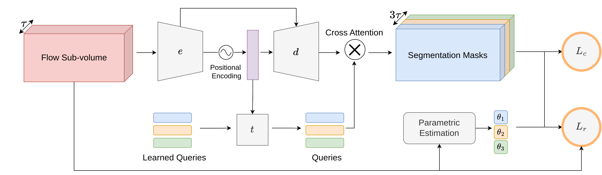

# LT-Space-Time-Flow-segmentation

Long-term flow segmentation is a code to segment a sequence of flow fields in one shot with temporally consistent labels. 

[REF]: Ref




## Inference

- For a simple inference process you can check in notebook : [Simple Segmentation Example](Notebooks/Simple-Segmentation-Example.ipynb)
- For an inference process using csvflowdatamodule you can check the notebook : [Inference](Notebooks/Inference.ipynb)

In order to do inference on a full dataset you can use the scripts in (`scripts/pred_extraction.py`) :

```bash
python3 scripts/pred_extraction.py\
 		--data_file DAVIS_D16Split\ # DataSplit to use
		--base_dir /path/to/data/folder # Path to the datafolder (DataSplit contains relative paths)
		--save_dir SavedModels/YourModel
        -cs -1 # Temporal cut size (-1: treat full sequence in one time)
        --save_vis
```

<u>Additional Params :</u> 

`--low_memory` : In case `cs` < sequence length treats all subsequences independently, reducing memory usage.

## Training


To train the model you can use the

```bash
python3 training.py --data_file Exp6_Split\ # DataSplit to use
			--base_dir /path/to/data/folder # Path to the datafolder (DataSplit contains relative paths)
			-L 4\  # Number of segmentation masks
            --inputs Flow-4 Flow-3 Flow-2 Flow-1 Flow Flow+1 Flow+2 Flow+3 Flow+4\ # Input flow fields
            --flows_volume Flow-4 Flow-3 Flow-2 Flow-1 Flow Flow+1 Flow+2 Flow+3 Flow+4\ # Target flow fields
            --len_seq 9 # Length above sequence 
            --regularisation '{"EulerPottsl1R3" : 1}'\ # Regularisation loss                 
            --param_model QuadraticFull_fk3\ # Parametric model to use (Quadratic with Spline control point every 3 frames)
            --flow_augmentation globalmotion.QuadraticFull_fk3.light\ # Flow Augmentation to use 
            --experimental_flag PerturbInputFlowNoise PerturbInputFlowNull # Flow perturbation during training 
            --limit_train_batches 0.1\ 
            --max_epochs 500\
            --save_dir SavedModels/YourModel
```

`save_dir`: The checkpoint (.ckpt) of the best model - defined as the one with the lowest validation loss - is saved along with a file "results.csv" that save score and jaccard for each frame during the training.

All other options have default preset up as the main result in the publication.

**Additional Options :**

- <u>Input Flow</u> :
  - `--image_size int int`  : choose the input  / output size for the frames. Publication : 128x224.
  - `-L int`  : Number of output masks. Publication : 4 or 2
  - `--experimental_flag [str]` : allows to add experimental changes to the code. In this version only the perturbation of the input flow is implemented. Publication : `PerturbInputFlowNoise PerturbInputFlowNull`

<u>Model Structure</u> :


- <u>Training Parameters :</u>
  - All Pytorch Lightning Parameters detailed here : [[link]](https://pytorch-lightning.readthedocs.io/en/latest/common/lightning_module.html)
  - Notably `--gpus int` to enable training with GPU
  - Logger : everything is setup to use a logger. We used [[Wandb]](https://docs.wandb.ai/). See [[PL documentation]](https://pytorch-lightning.readthedocs.io/en/latest/) to setup your own.

## CSV Flow Module

In order to use this code with your data you need to create your own "DataSplit" csv files. Those files contain the path to the files used for training / evaluation. Each row represents a sample and columns the file for each modality. You can find more information in this [description](csvflowdatamodule/README.md).

The Datasplit used for training is given as an example as Exp6_Split. It corresponds to training on `FT3D` and Validation on `DAVIS`. 


## Evaluation

Evaluation for all datasets are described in [evaluation](evaluation/README.md).


## Computed Results and Model Weight :

You can find results, evaluations and pre-trained weights here :

[[RESULTS](https://gitlab.inria.fr/emeunier/st-space-time-flow-segmentation-data)]

You will also find timing of our method on ` P100 Gpu` with varying input size and number of masks in  `"306h8xd2/Results_Timer_P100.pdf"` file.


## Requirements

```
torch==1.13.1
pytorch_lightning==1.8.6
sklearn==1.1.3
flowiz
tqdm
ShapeChecker
```